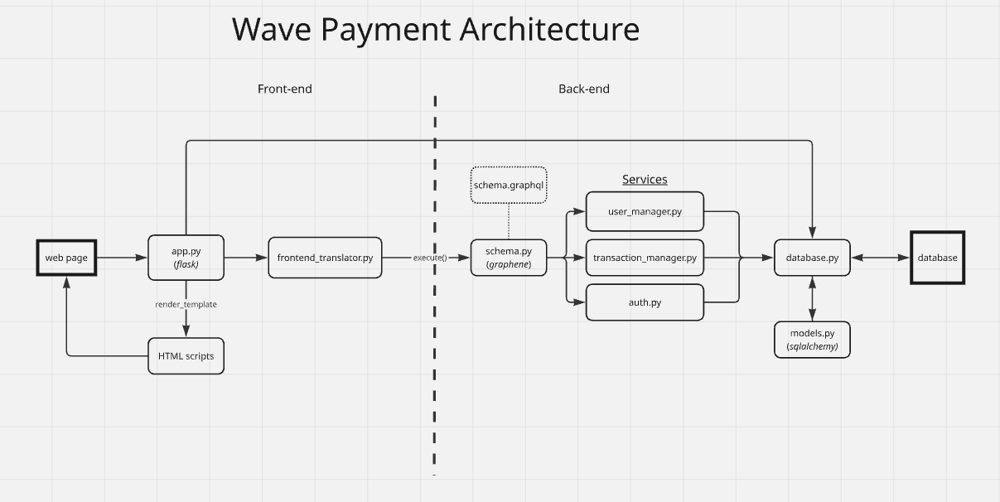

# Wave Payment System

## Project Overview
This project is to get hand-on experience with the following tools:
- GraphQL (graphene)
- PostgreSQL (sqlalchemy)
- Flask

## Architecture

## Features

<!-- ## Installation
- Clone the git repo
- Run 'pip install -r requirements'
- Run app.py -->

## Remote Server
- Clone the repo
- Make sure you have python and pip
    - ```sudo apt update && sudo apt install -y python3 python3-venv python3-pip```
- Create and activate your venv file
```python3 -m venv venv```
```source venv/bin/activate```
- Install requirements
```pip install -r requirements.txt```

- Install postgreSQL
```sudo apt install -y postgresql```


## GraphQL Schema
See ```schema/schema.graphql```

## ToDo
- Error handling: I need to make the frontend_translator correcly handle all errors that come from the GraphQL API. Maybe I should have an error page that it loads.
- There is no password check at login
- We do not correctly display 'Incorrect username' message to the user
- We should hash the passwords
- Add mypy typechecks
- Back to homepage button (logout)
- You can pay yourself
- Only shows money leaving your account
- Can just type URL to get behind login screen

